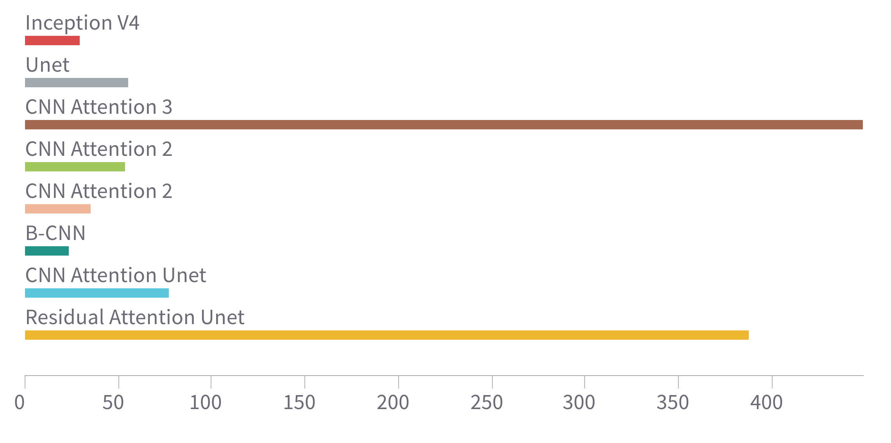

# Radiograph-Age-Prediction

## Deep learning regression for predicting bone age from radiograph images

Different architectures have been tested here from basic to high level. An implementation of soft attention could be found here. The architectures used are 
- Baseline CNN
- CNN with Attention
- Inception V4
- Unet
- Attention Unet
## Data source
Follow this [link](https://www.rsna.org/education/ai-resources-and-training/ai-image-challenge/rsna-pediatric-bone-age-challenge-2017) to download the whole dataset.

## Running the Code
run `train.py` and `train_ismail.py` files. The paths should be adjusted as required. The hyperparameters can be set in `hparams.py` file

## Results from our run

